# SegurApp

## ⭐ Integrantes ⭐

- **Antonio Labra Guerrero**
- **Oscar Chávez Rosales**
- **Astrid Guerrero Niño**
- **Regina Bernal Galicia**

## Forma de Trabajo

El proyecto será manejado dentro de la carpeta **Segurapp**, a lo largo del curso y según lo visto en cada sesión.
De igual forma se implementará en el archivo README.md una breve descripción de las actividades realizadas.

## Cuenta probada en Firebase

- Correo: krz.oficial@gmail.com
- Password: Oscar123@

## Comunicación

- [Grupo de Telegram](https://t.me/joinchat/ofA0XlzS44tjMzYx)
- [Grupo en Slack](https://beduworkspace.slack.com/archives/C02BTP8SL1M)

## Documentación

- [Proyecto Final de Kotlin Avanzado](https://docs.google.com/document/d/1SGPDS2SpD3aaOYSw_Aa9AMWqyJBg5N_6/edit?usp=sharing&ouid=107584529257334960745&rtpof=true&sd=true)

## Diseños

- [Wireframes y Mockups](https://www.figma.com/file/xiA0LvmRgZl1jkEX6cJdto/Segurapp)

# Desarrollo: Proyecto SegurApp (Fase 3)

## Objetivo principal

Desarrollar una aplicación móvil enfocada a la seguridad personal, la cual proporciona servicios de rastreo y notificaciones a contactos seleccionados para auxiliar al usuario ante una situación de emergencia que se le presente.

## Descripción general del proyecto

SegurApp es una aplicación movil enfocada a la seguridad personal, incorpora servicios de rastreo en tiempo real, acceso directo a servicios públicos, contactos de confianza y notificaciones.

## ¿Por qué surge SegurApp?

En México, una problemática recurrente entre la sociedad es la inseguridad, siendo el robo a mano armada, extorción y secuestro las principales causas en el país. Los gobiernos locales y estatales han implementado estrategias para combatirlo, sin embargo, los tiempos de respuesta suelen ser deficientes. El proyecto pretende crear alternativas tecnológicas para garantizar la vida de las personas ante un incidente, mediante el uso de una aplicación móvil que permita el rastreo en tiempo real del usuario, envió de notificaciones automáticas, comunicación directa con servicios públicos y una lista de contactos de confianza.

<!--
## Mockups SegurApp

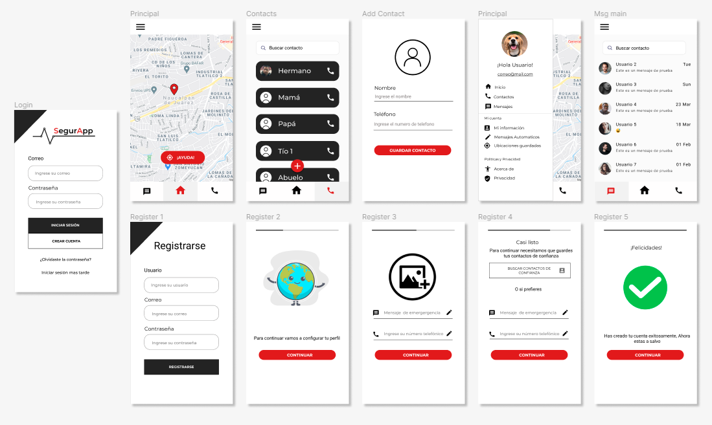

## Descripción de las pantallas

- La primera cuenta con un mapa que permite obtener nuestra ubicación en tiempo real, para activar dicha función se tiene un botón de pánico.
- La segunda es una pantalla de contactos, donde se podrá acceder y agregar contactos de confianza, mismos que serán usados para recibir una notificación en caso de una emergencia.
- La tercera pantalla es un chat, permitiendo comunicar con algunos de los contactos de forma directa, dentro de ella se implementarán diversas funciones y servicios de acceso rápido, dichas funciones se pueden observar en la pantalla cuatro.
- La quinta pantalla muestra un menú, donde se puede acceder a múltiples opciones, como la información general del usuario, mensajes macros (usados al momento de enviar una señal de auxilio) y otras funciones.
- Las ultimas pantallas hacen referencia al registro de la app, mediante un login, además de esta pantalla se pretende crear una de registro. El ultimo mockup muestra un servicio de video llamada, mismo que es accesible mediante la pantalla de chat.
-->

<!--
# Sesión 1: Introducción a Android 🚀

## Postwork 📋

- Definir el proyecto con el que se trabajará durante el módulo.
- Interpretar los lineamientos que integran el proyecto.
- Modelar la idea básica de nuestra aplicación.

## Proyecto 📋

- Definir el proyecto con el que se trabajará durante el módulo.
- Interpretar los lineamientos que integran el proyecto.
- Programar la idea básica de nuestra aplicación.

# Sesión 2: Views 🚀

## Postwork 📋

- Programar la idea básica de nuestra aplicación.
- Implementar nuevas Views al proyecto.

## Proyecto 📋

- Implementar Views al proyecto.
- Crear un formulario.

# Desarrollo

## Se crearon los formularios principales de la aplicación:

## Login
El primero es la pantalla login, en el se especifican campos como el correo y la contraseña, asi como un botón de ingresar y registrarse, estos envian a una Activity específica.

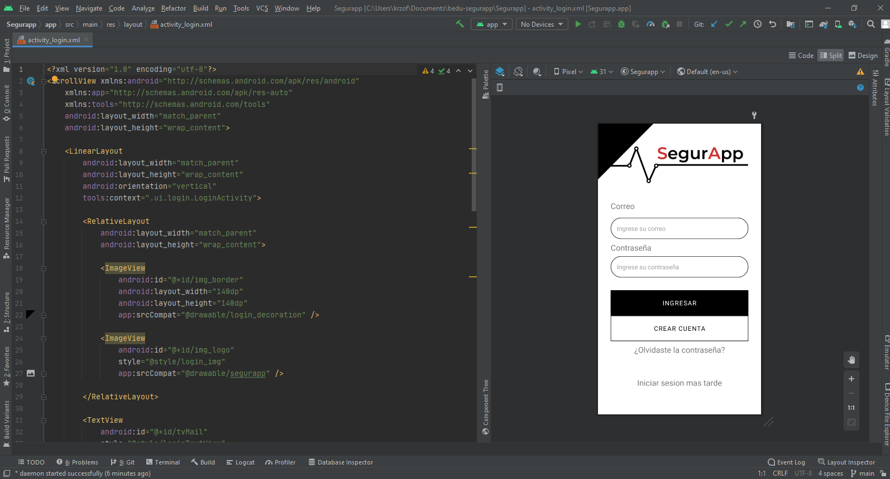

## Register
El segundo es la pantalla de registro, en el se especifican los datos necesarios del usuario (como el nombre de usuario, correo y contraseña).

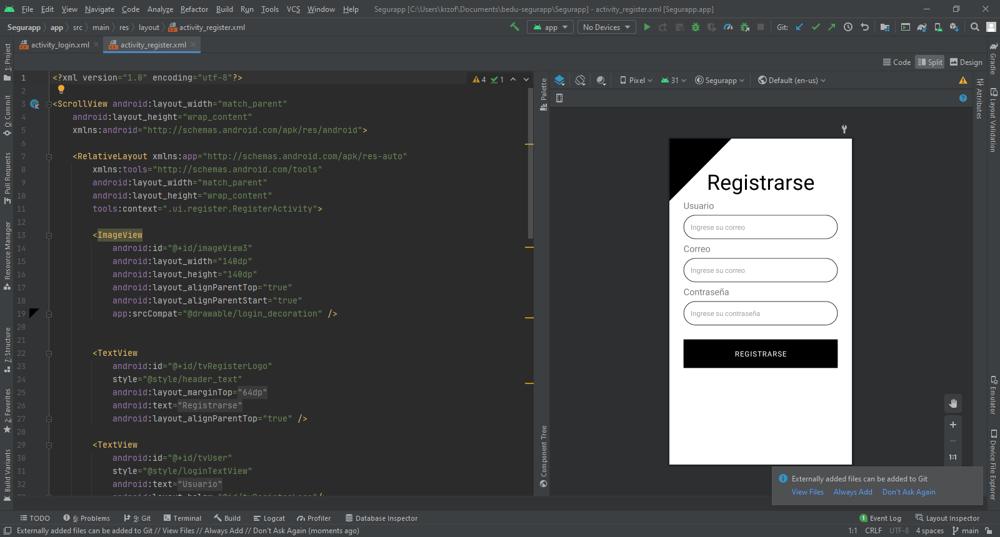

# Implementaciones Posteriores

## Forgot Password
Se implementaron los formularios restantes de la aplicación, en el caso de la opción de "olvidar contraseña" , se creo mediante un DialogFragment.

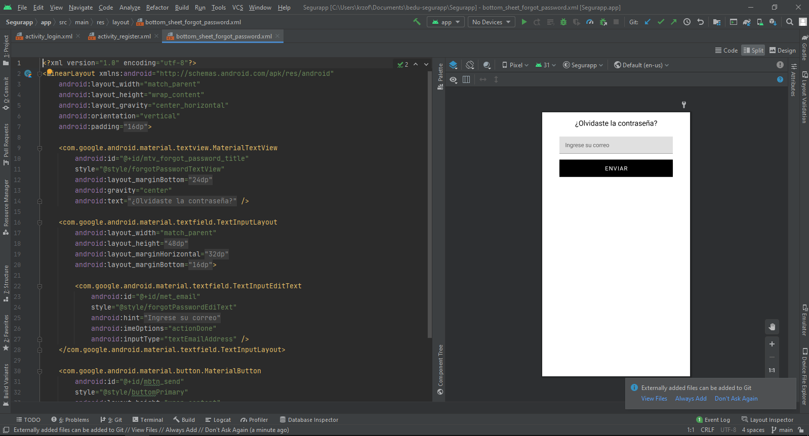

## Porfile Configuration
Se creo otro formulario que es utilizado al momento de registrarse, este es una guia para introducir los datos necesarios, como un mensaje y el número de teléfono.

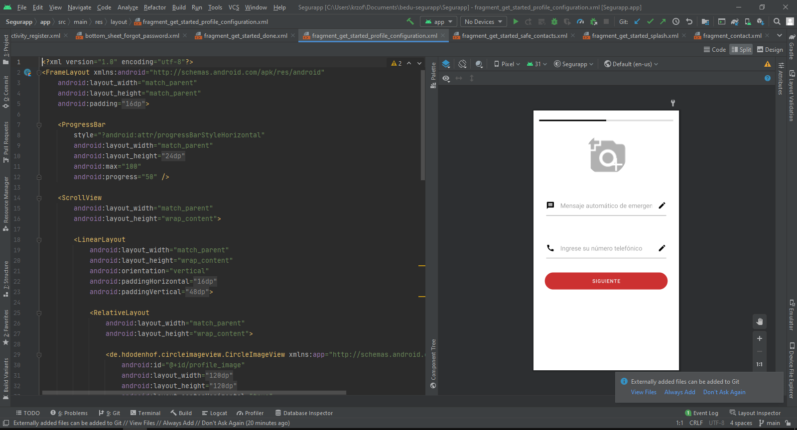

## Safe Contacts
Además, se creo una pantalla para agregar contatos, esta permite añadirlos directamente de nuestra lista personal de contactos, asi como una opción para agregarlos manualmente (para ello, es importante activar los permisos para leer contactos)

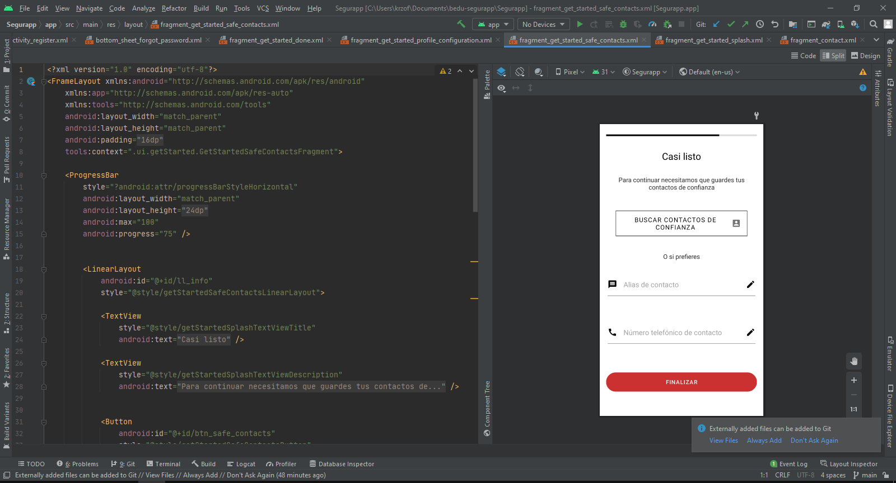

# Sesión 3: Activities y Layouts 🚀

## Postwork 📋

- Orientarse en la implementación de nuevas Activities y sus layouts.

## Proyecto 📋

- Crear un flujo entre Activities.
- Diseñar los layouts de las Activities con ConstraintLayout.

# Desarrollo

### Nombre de la Aplicación:

> SegurApp V1

## Introducción

Los dispositivos móviles forman parte de nuestras vidas, podemos reservar boletos de avión, pedir comida, escuchar música, ver vídeos entretenidos, tomar fotografías y muchas otras cosas, hace unas cuantas décadas realizar todo esto con un solo dispositivo era imposible. En la actualidad, los celulares cuentan con múltiples funcionalidades, no obstante, hoy utilizamos el teléfono casi para todo menos para hablar y claro, existen los chats y las redes sociales pero si estuvieras en una situación de riesgo: ¿A quién acudirías?, ¿Contestaría rápido?, ¿Qué tan fácil sería poder hacerlo? Tan solo en México, _el 77.6% de la población dijo sentirse insegura en un cajero público y 63% en el banco durante junio de 2021_, sin dudas, el índice de delincuencia aumenta conforme pasan los años y la seguridad de nuestros seres queridos debe ser una prioridad. Es por esto que decidimos crear **SegurApp**, una aplicación que te pondrá en contacto con personas de tu confianza y/o realizar llamadas de emergencia, tan solo necesitas accionar un botón de auxilio y una alerta será enviada a todos tus contactos de confianza brindándoles tu ubicación actual.

## ¿Cómo funciona la aplicación?

Lo primero que debes hacer es crear una cuenta dentro de nuestro sistema utilizando un correo electrónico y una contraseña.
Después, será necesario configurar tu cuenta. Aquí te pediremos que brindes tu nombre, tu número de teléfono y también que generes una lista de contactos de tu confianza, lo mejor es que puedes buscarlos directamente desde tu tarjeta de contactos (para ver esta lista de contactos en un futuro será necesario contar con tu autorización mediante un PIN que podrás configurar), finalmente, solicitaremos tu permiso para poder acceder a tu ubicación actual y tu red telefónica.
Listo, ¡ahora estás a salvo!, si en algún momento necesitas ayuda podrás presionar un botón de emergencia dentro de nuestra aplicación, o bien, hacerlo directamente desde el área de notificaciones. (es necesario activar la notificación previamente)
Al accionar el botón de ayuda podrás compartir tu ubicación con todos tus contactos de confianza, además que también podrás chatear con ellos.
En caso que necesites contactar con un servicio de emergencia deberás presionar con larga duración el mismo botón y tu teléfono marcará directamente a emergencias donde un operador estará disponible para poder ayudarte.

## Proceso de Mockups

A continuación se presenta la propuesta desarrollada para poder implementar el flujo de nuestra aplicación

## Bibliografía

[Percepción de inseguridad en México sube a 66.6% en junio: Inegi](https://www.forbes.com.mx/percepcion-de-inseguridad-en-mexico-sube-a-66-6-en-junio)

# Implementación de código

## Creación de Flujo

Mediante el uso de Intents, se realizó la comunicación entre Activitys y Fragments, de esta forma pusimos en práctica la idea anteriormente mencionada.

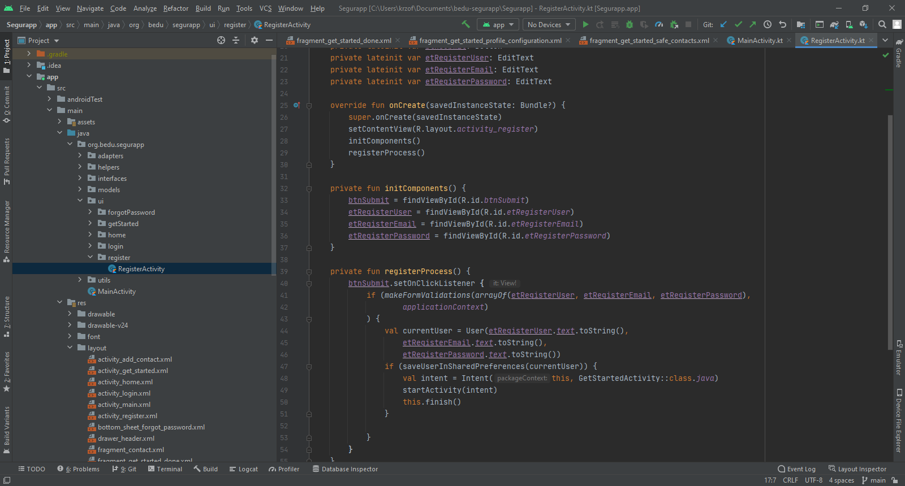

# Sesión 4: Listas 🚀

## Postwork 📋

- Aplicar el conocimiento de Listas a la tienda en línea.

## Proyecto 📋

- Aplicar el conocimiento de Listas a nuestro proyecto.

# Desarrollo

Para el desarrollo de este Postwork y Proyecto, se genero un RecyclerView en la vista de contactos, debido a que permite la integración de múltiples objetos dentro de cada elemento de la lista.

## Item Contact
Se genero un Item para los contactos, mismo que va a ser el molde de la RecyclerView.

## Item Messages
De la misma manera, se generó un Item para los mensajes, en el se indica una foto de perfil, un nombre, mensajes y hora del último mensaje.

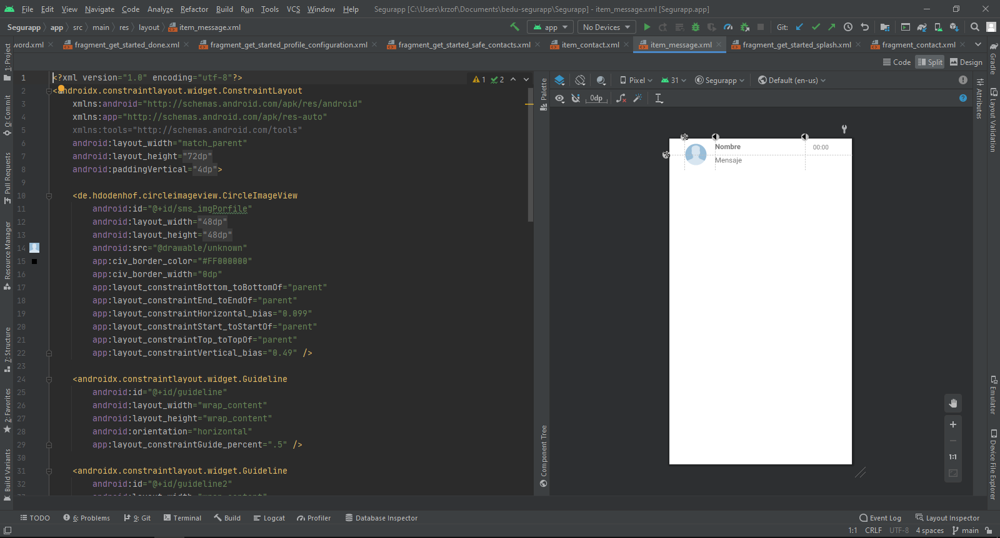

## Fragment Contact
Podemos ver que al poner el RecyclerView con origen al Item contact, nos muestra un preview, de como se va a mostrar dicho Fragment al inflarlo con una lista de contactos.

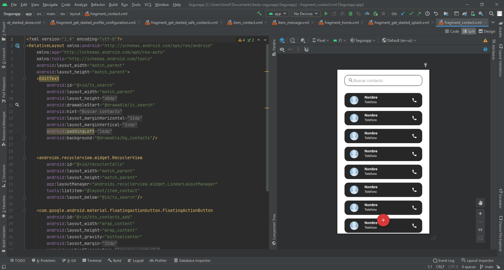

## Fragment Message
Al igual que el ejemplo anterior (Fragment Contact) se realizó un proceso simiar, pero utilizando el Item Message.

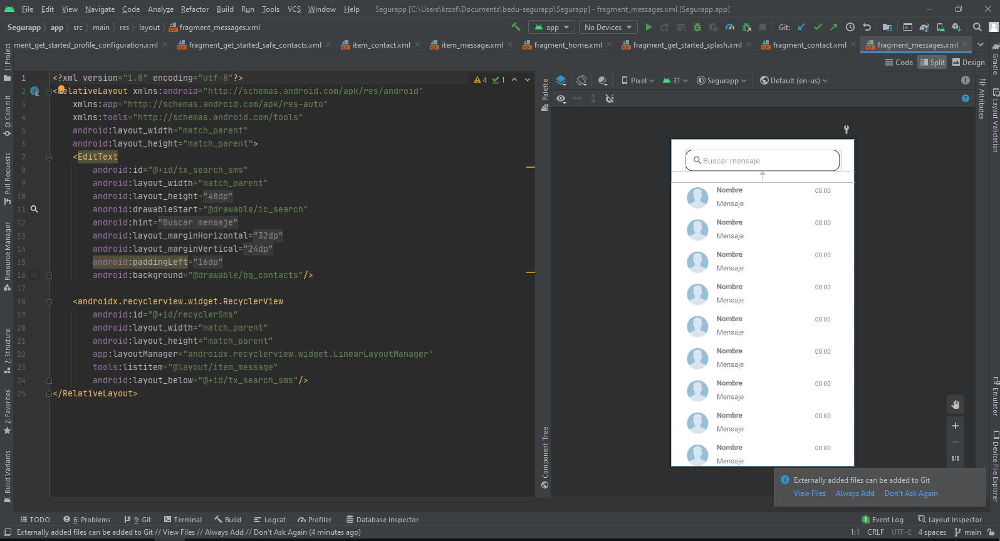

# Sesión 5: Fragments 🚀

## Postwork 📋

- Orientarse en la implementación de fragments para el proyecto.

## Proyecto 📋

- Modularizar el proyecto mediante Fragments.
- Manejar un flujo entre fragments

# Desarrollo
Se orientó el proyecto a fragments desde sesiones anteriors, debido a que ofrece algunos beneficios respecto a los Activitys, como lo es el rendimiento. Además de que al implementr un BottomNavigationMenu y dar click, debe permanecer en el mismo Activity, cambiando de Fragment solamente.

<table>
    <td>
        <tr>
        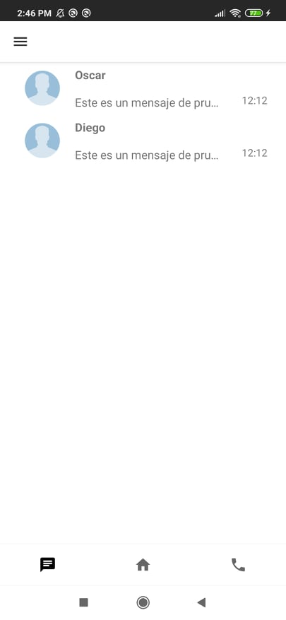
        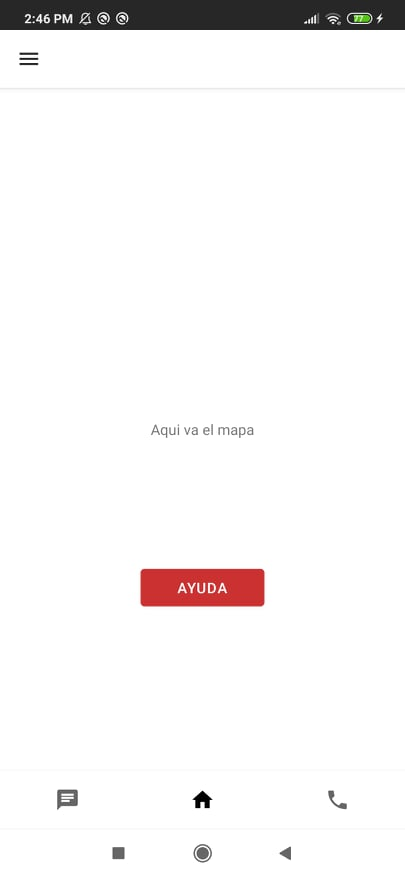
        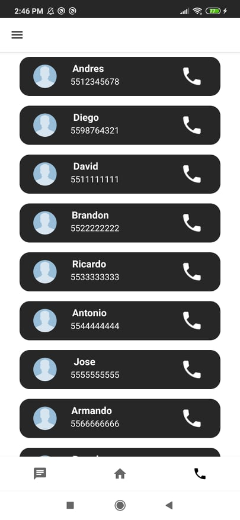
        </tr>
    </td>
</table>

# Sesión 6: Material Design 🚀

## Postwork 📋

- Recuperar la implementación de Material Design para orientar proyectos Android.

## Proyecto 📋

- Personalizar el tema y estilo del layout mediante Themes y Components de Material Design.
- Agregar un AppBar personalizado a nuestro proyecto.
- Crear un NavigationDrawer para enriquecer de rutas a nuestra aplicación.

# Desarrollo

## Colors

Se definió una lista de colores, en la  siguiente imagen podemos observar el tema por defecto de la app y debajo de ellos se encuentra los colores de la app.

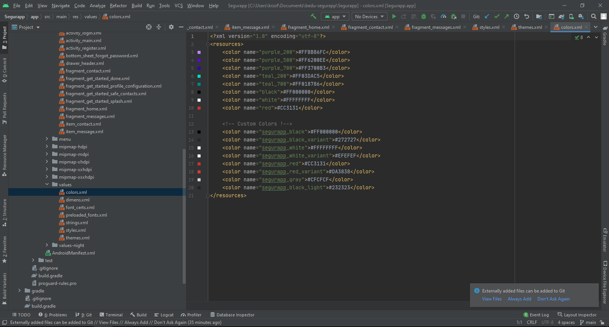

- Blanco: Se definio este color debido a que es una app pensada en ser usada en exteriores, por lo que necesita contrastes sin perder la legibilidad.

- Negro: Este color da contraste al color blanco, además de demostrar la seeriedad de la app.

- Rojo: Este color esta relacionado directamente como un color de emergencia, es usada en muchos ámbitos de la salud, por ellos su elección.

## Themes

Los colores antes mecionados fueron colocados por default en la sección de temas, esta define los colores principales del proyecto.

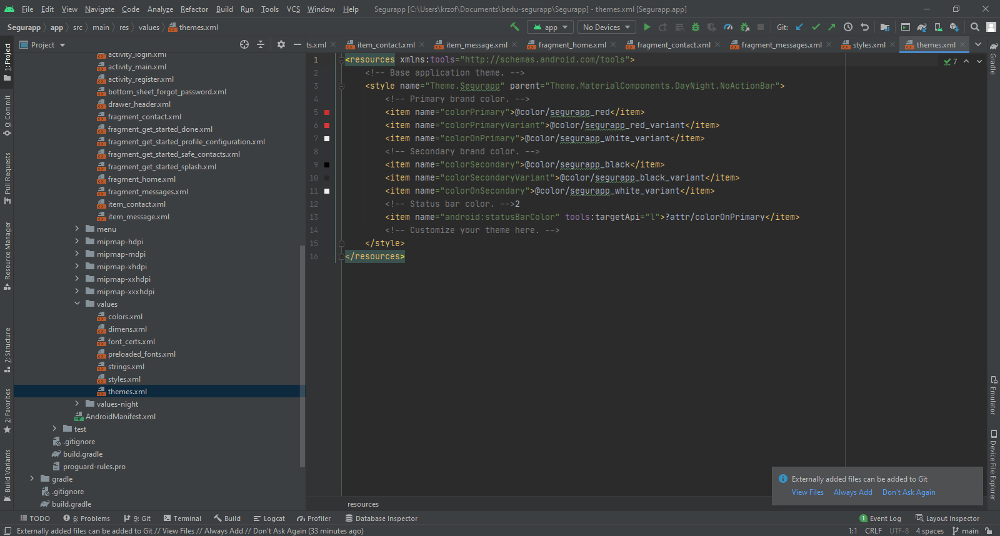

# Sesión 7: Menús 🚀

## Postwork 📋

- Implementar un ActionMode de manera flotante.
- Implementar dos clases, una para el manejo de ActionMode de manera Primaria, y otra clase para manejarlo de manera Flotante.

## Proyecto 📋

- Implementar el uso de Menús Contextuales y Menús Flotantes.

# Desarrollo

Se implementaron 2 ActionMode Flotantes, el primero mandará una alerta a los usuarios que tengamos agregados. el segundo permite abrir una Actividad, la cual será utilizado para agregar contactos.
<table>
    <td>
        <tr>
        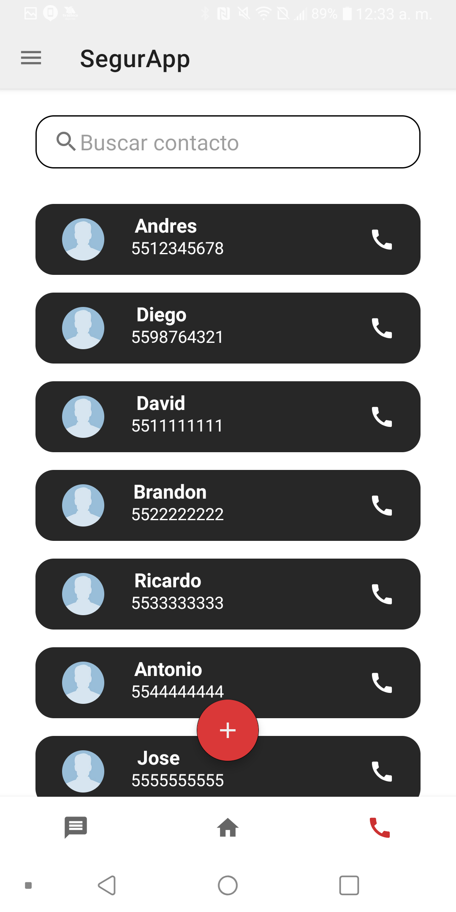
                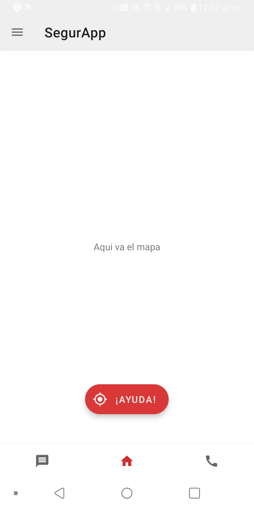
        </tr>
    </td>
</table>

# Sesión 8: Gradle y Preparación para lanzamiento 🚀

## Postwork 📋

- Explicar la implementación de flavors como orientación para un proyecto Android personal.

## Proyecto 📋

- Generar variantes de nuestra aplicación.
Configurar lo básico en gradle.
Hacer pruebas con nuestra aplicación de debug.
Lanzar una versión de Release de nuestra aplicación.
-->
