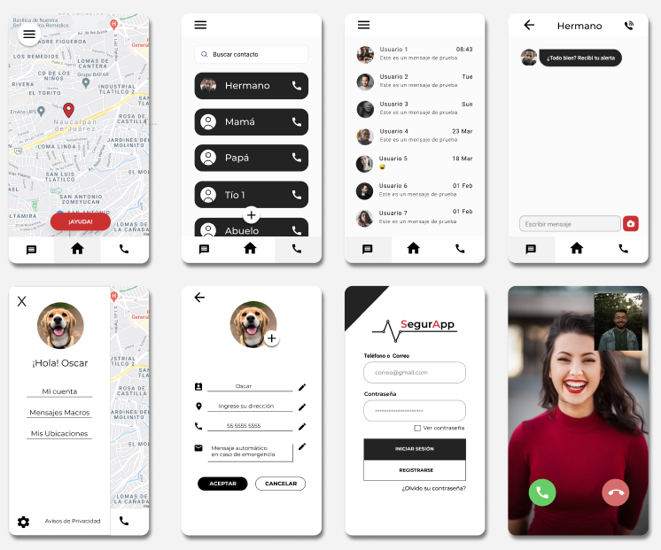

# Sesión 1: Introducción a Android

## Postwork

- Definir el proyecto con el que se trabajará durante el módulo.
- Interpretar los lineamientos que integran el proyecto.
- Modelar la idea básica de nuestra aplicación.

## Proyecto 

- Definir el proyecto con el que se trabajará durante el módulo.
- Interpretar los lineamientos que integran el proyecto.
- Programar la idea básica de nuestra aplicación.

# Desarrollo: Proyecto SegurApp

## ¿Por qué surge SegurApp?

En el marco histórico de nuestra nación, uno de los mayores problemas a los cuales todos los mexicanos se han tenido que enfrentar, es la inseguridad. Un problema social de gran impacto que provoca miedo, ansiedad y preocupación a los mexicanos. 
Entre las principales problemáticas se encuentran casos de desapariciones, secuestros, robos y asaltos. De acuerdo con cifras oficiales proporcionadas por el INEGI un 66.4% de la población de 18 años y más considera que vivir en su ciudad es inseguro. 

El proyecto busca dar respuesta a estos incidentes mediante un software para dispositivos móviles, el cual beneficiará a toda persona que la instale y a sus contactos cercanos.

## Mockups SegurApp

## Descripción de las pantallas

- La primera cuenta con un mapa, permitiendo obtener nuestra ubicación en tiempo real, para activar dicha función se tiene un botón de pánico.
- La segunda es una pantalla de contactos, donde se podrá acceder y agregar contactos de confianza, mismos que serán usados para recibir una notificación en caso de una emergencia.
- La tercera pantalla es un chat, permitiendo comunicar con algunos de los contactos de forma directa, dentro de ella se implementarán diversas funciones y servicios de acceso rápido, dichas funciones se pueden observar en la pantalla cuatro.
- La quinta pantalla muestra un menú, donde se puede acceder a múltiples opciones, como la información general del usuario, mensajes macros (usados al momento de enviar una señal de auxilio) y otras funciones.
- Las ultimas pantallas hacen referencia al registro de la app, mediante un login, además de esta pantalla se pretende crear una de registro. El ultimo mockup muestra un servicio de video llamada, mismo que es accesible mediante la pantalla de chat.

