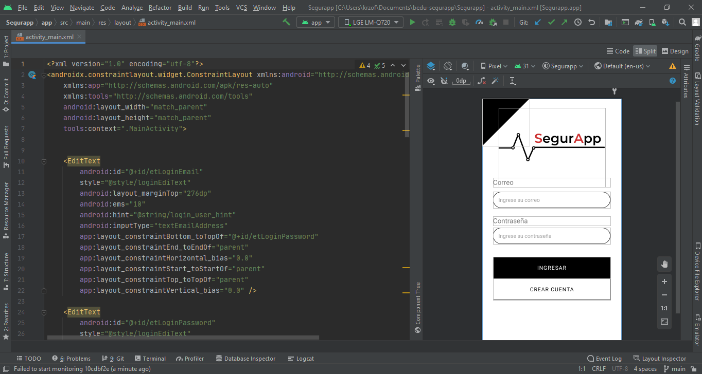

# Sesión 2: Views

## Postwork

- Programar la idea básica de nuestra aplicación.
- Implementar nuevas Views al proyecto.

## Proyecto

- Implementar Views al proyecto.
- Crear un formulario.

# Desarrollo 

Se crearon 2 formularios de registro: 
- El primero es una pantalla login, el cual tiene un EditText de tipo email, otro de tipo password y 2 botones, dicho formulario se desarrolló con Contrain Layout (aunque en un principio se utilizó LinearLayout) dicho cambio, fue para practicar las diferentes formas de crear diseños de pantallas.

- El segundo es una pantalla de registro, el cual está conformado por Editext de tipo plaintext, en el que el usuario pondrá un nombre para utilizar en la aplicación, otro de tipo email y finalmente uno de tipo password.

## Login

## Register

