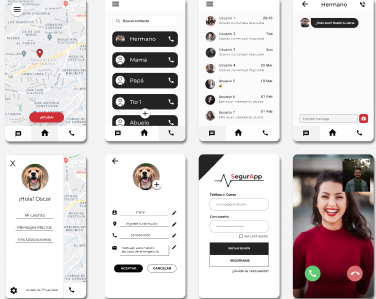

# Sesión 3: Activities y Layouts

## Postwork

- Orientarse en la implementación de nuevas Activities y sus layouts.

## Proyecto

- Crear un flujo entre Activities.
- Diseñar los layouts de las Activities con ConstraintLayout.

### Nombre de la Aplicación:

> SegurApp V1

# Postwork S3

## Introducción

Los dispositivos móviles forman parte de nuestras vidas, podemos reservar boletos de avión, pedir comida, escuchar música, ver vídeos entretenidos, tomar fotografías y muchas otras cosas, hace unas cuantas décadas realizar todo esto con un solo dispositivo era imposible. En la actualidad, los celulares cuentan con múltiples funcionalidades, no obstante, hoy utilizamos el teléfono casi para todo menos para hablar y claro, existen los chats y las redes sociales pero si estuvieras en una situación de riesgo: ¿A quién acudirías?, ¿Contestaría rápido?, ¿Qué tan fácil sería poder hacerlo? Tan solo en México, _el 77.6% de la población dijo sentirse insegura en un cajero público y 63% en el banco durante junio de 2021_, sin dudas, el índice de delincuencia aumenta conforme pasan los años y la seguridad de nuestros seres queridos debe ser una prioridad. Es por esto que decidimos crear **SegurApp**, una aplicación que te pondrá en contacto con personas de tu confianza y/o realizar llamadas de emergencia, tan solo necesitas accionar un botón de auxilio y una alerta será enviada a todos tus contactos de confianza brindándoles tu ubicación actual.

## ¿Cómo funciona la aplicación?

Lo primero que debes hacer es crear una cuenta dentro de nuestro sistema utilizando un correo electrónico y una contraseña.
Después, será necesario configurar tu cuenta. Aquí te pediremos que brindes tu nombre, tu número de teléfono y también que generes una lista de contactos de tu confianza, lo mejor es que puedes buscarlos directamente desde tu tarjeta de contactos (para ver esta lista de contactos en un futuro será necesario contar con tu autorización mediante un PIN que podrás configurar), finalmente, solicitaremos tu permiso para poder acceder a tu ubicación actual y tu red telefónica.
Listo, ¡ahora estás a salvo!, si en algún momento necesitas ayuda podrás presionar un botón de emergencia dentro de nuestra aplicación, o bien, hacerlo directamente desde el área de notificaciones. (es necesario activar la notificación previamente)  
Al accionar el botón de ayuda podrás compartir tu ubicación con todos tus contactos de confianza, además que también podrás chatear con ellos.
En caso que necesites contactar con un servicio de emergencia deberás presionar con larga duración el mismo botón y tu teléfono marcará directamente a emergencias donde un operador estará disponible para poder ayudarte.

## Proceso de Mockups

A continuación se presenta la propuesta desarrollada para poder implementar el flujo de nuestra aplicación

## Bibliografía

[Percepción de inseguridad en México sube a 66.6% en junio: Inegi](https://www.forbes.com.mx/percepcion-de-inseguridad-en-mexico-sube-a-66-6-en-junio)
