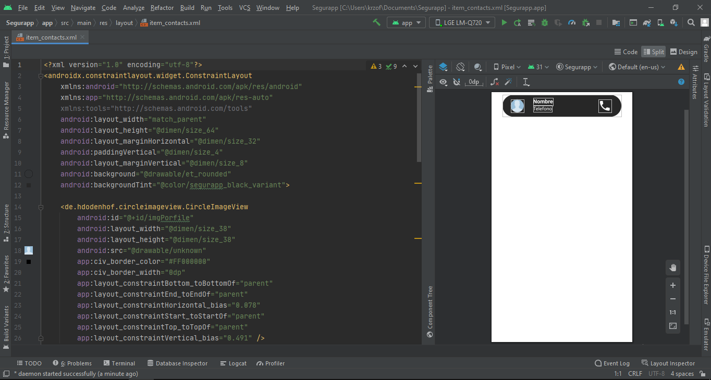
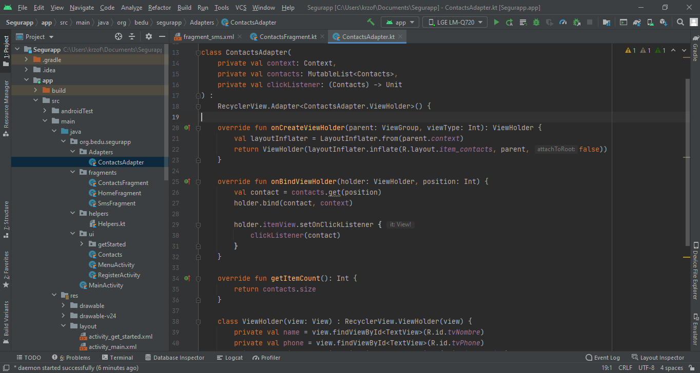
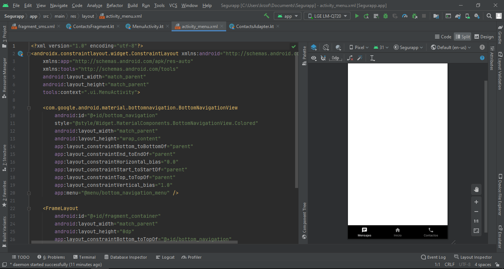
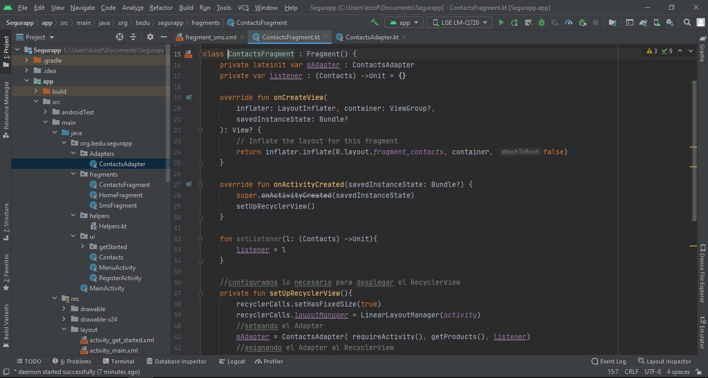
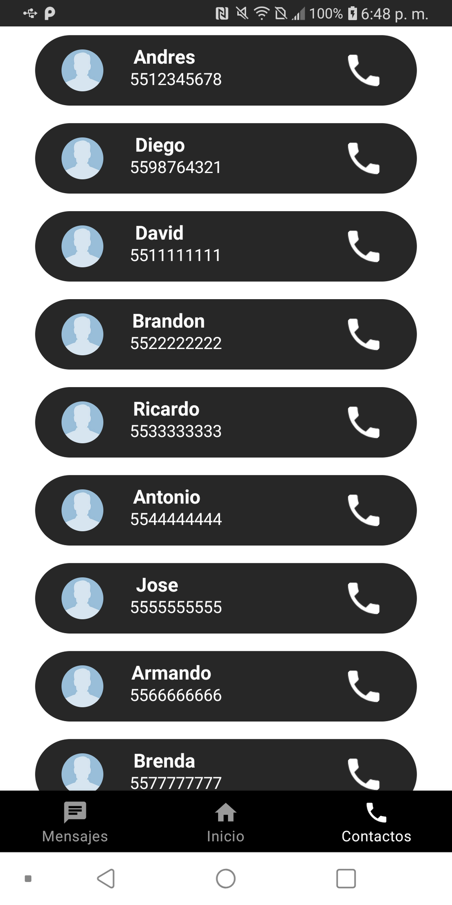

# Sesión 4: Listas

## Postwork

- Aplicar el conocimiento de Listas a la tienda en línea.

## Proyecto

- Aplicar el conocimiento de Listas a nuestro proyecto.

# Desarrollo

Para el desarrollo de este Postwork y Proyecto, se genero un RecyclerView en la vista de contactos, debido a que es una lista de elentos. 

## Item
Se genero un Item, mismo que va a ser el molde para los demas elementos.

## Adapter
Se creo un Adaptador (basado en el ejercicio mostrado en la Clase 4 y Clase 5).

## Menu
Se genero un Menu, el cual es la pantalla principal de la aplicacion, en el se coloco un BottomNavigationBar .

## Fragments
Se utilizo fragments para almacenar y mostrar los RecyclerViews.

## Resultado
Al compilar el proyecto y probarlo, podemos observar que el RecyclerView funciona correctamente, se coloco imformacion dentro del codigo, sin embargo se planea agregar contactos mediante un boton.
