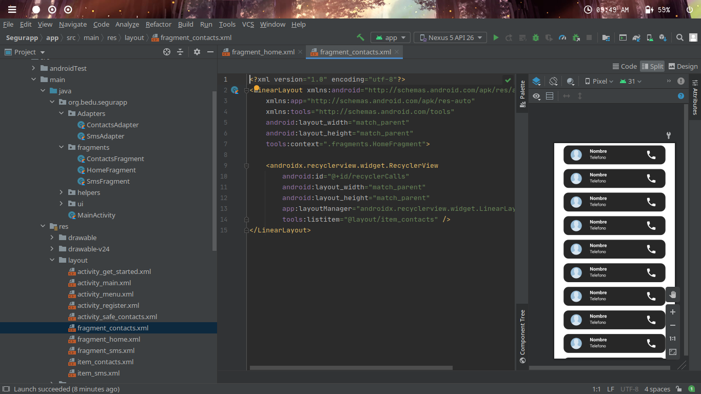
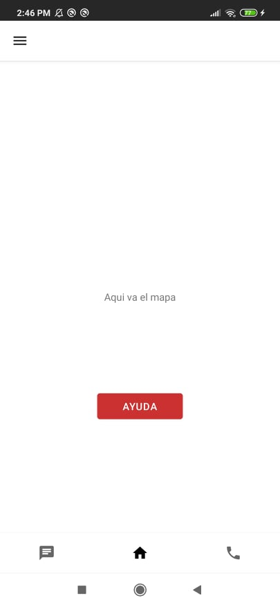
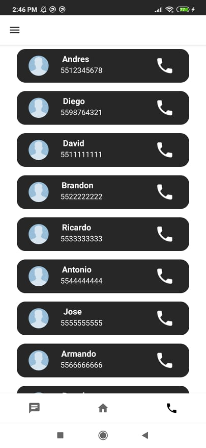
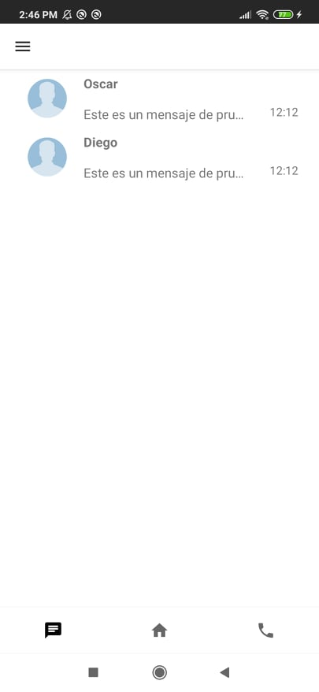

# Sesión 5: Fragments

## Postwork

- Orientarse en la implementación de fragments para el proyecto.

## Proyecto

- Modularizar el proyecto mediante Fragments.
- Manejar un flujo entre fragments

# Desarrollo 
Se orientó el proyecto a fragments en sus 3 pantallas principales (contactos, home y chats). Se pretende implementar también en las pantallas secundarias, para ingresar datos al dar click (ya sea mediante fragments o dialog fragments).

## Home
En esta pantalla se va a implementar un mapa, por ello queda vacía.

## Contactos
En esta pantalla se muestran los contactos agregados a la aplicación.

## Mensajes
La siguiente pantalla muestra el historial de mensajes.

